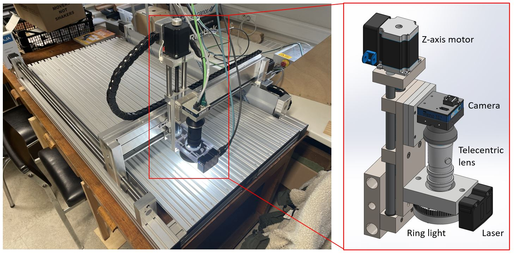
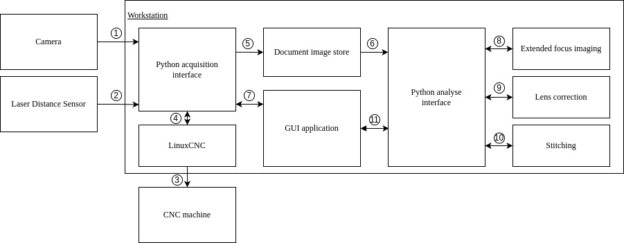
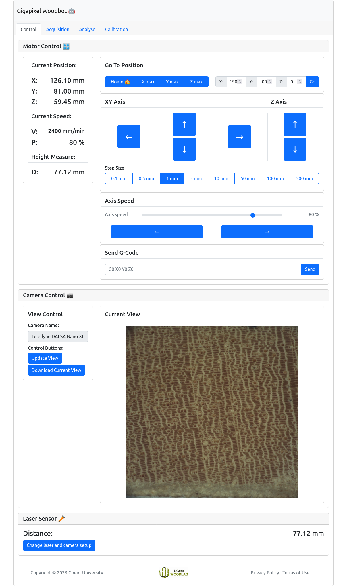
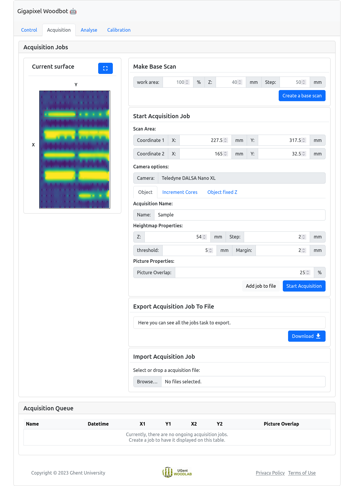
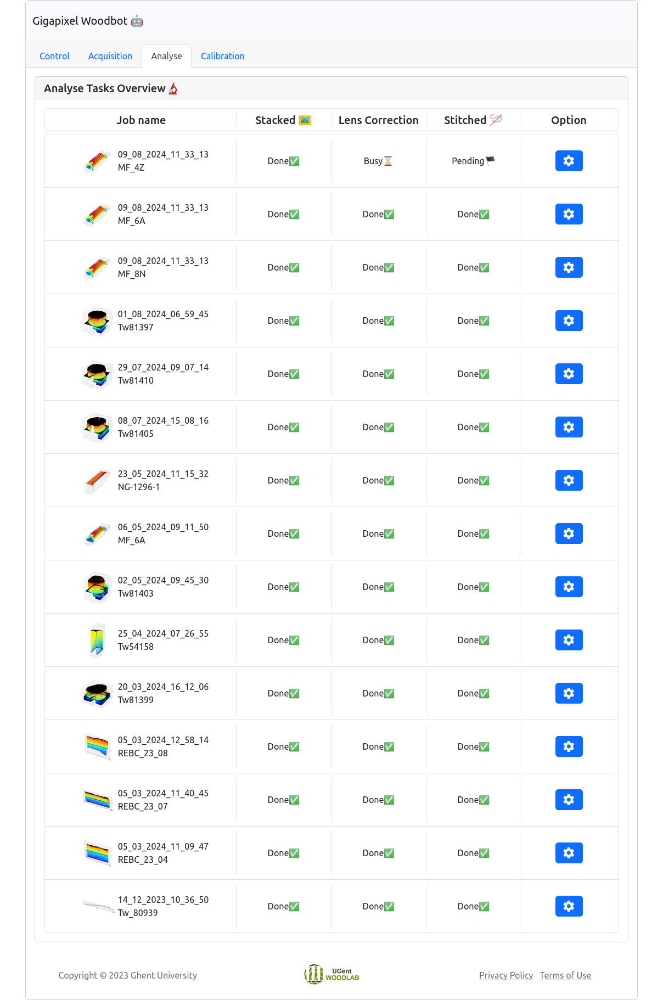
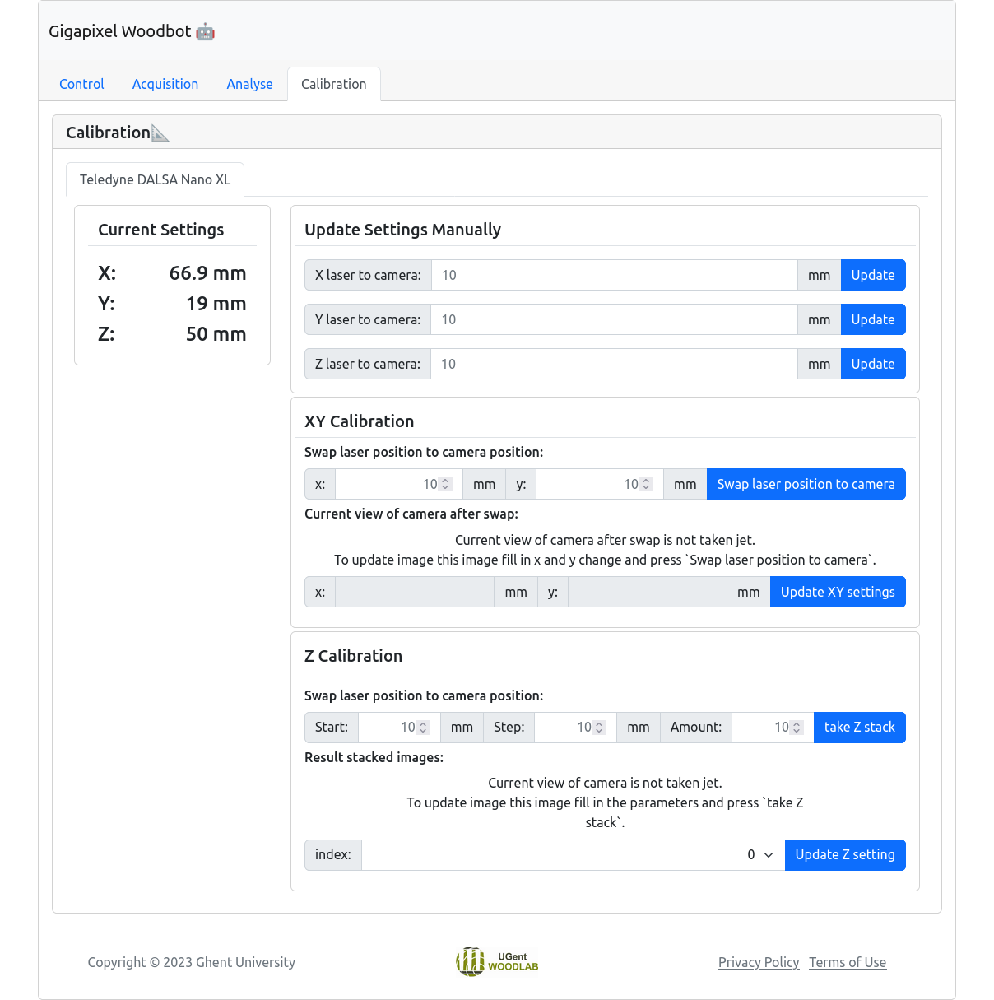

<p align="center">
  
</p>
<p align="center">
    <h1 align="center">Gigapixel Woodbot</h1>
</p>
<p align="left">
    This is the repository for our custom-built system that we call Gigapixel Woodbot. This system is a modular imaging system that enables automated scanning of large wood surfaces. The frame of the robot is a CNC (Computer Numerical Control) machine to position a camera above the objects. Images are taken at different heights for stacking and in both X and Y directions, with a small overlap between consecutive images and merged, by mosaic stitching, into a gigapixel image. Multiple scans can be initiated through the graphical application, allowing the system to autonomously image several objects and large surfaces.
</p>

<p align="center">
	<!-- local repository, no metadata badges. --></p>
<p align="center">
		<em>Built with the tools and technologies:</em>
</p>
<p align="center">
    
    
    
    
	
    
    <br>
	
    
	
	
	
</p>
<br>

#####  Contributors
[Jan Van den Bulcke](https://orcid.org/0000-0003-2939-5408)[^aut][^cre][^WOODLAB];
[Louis Verschuren](https://orcid.org/0000-0002-3102-4588)[^aut][^WOODLAB][^FORNALAB];
[Ruben De Blaere](https://orcid.org/0000-0002-5736-9701)[^aut][^WOODLAB][^AFRM];
Simon Vansuyt[^aut][^WOODLAB][^AIRO];
[Maxime Dekegeleer](https://orcid.org/0000-0003-2096-4061)[^aut][^WOODLAB];
[Pierre Kibleur](https://orcid.org/0000-0002-0078-4680)[^aut][^WOODLAB][^UGCT];
[Olivier Pieters](https://orcid.org/0000-0002-5473-4849)[^aut][^AIRO];
[Tom De Mil](https://orcid.org/0000-0001-6207-9613)[^aut][^FISL];
[Wannes Hubau](https://orcid.org/0000-0003-3795-4986)[^aut][^WOODLAB][^AFRM];
[Hans Beeckman](https://orcid.org/0000-0001-8954-6277)[^aut][^AFRM];
[Joris Van Acker](https://orcid.org/0000-0002-8961-0176)[^aut][^WOODLAB];
[Francis wyffels](https://orcid.org/0000-0002-5491-8349)[^aut][^AIRO];

[^aut]: author
[^cre]: contact person
[^WOODLAB]: UGent-Woodlab, Department of Environment, Ghent University, Coupure Links 653, Gent, 9000, Belgium
[^FORNALAB]: ForNaLab, Department of Environment, Ghent University, Geraardsbergsesteenweg 267, Merelbeke (Gontrode), 9090, Belgium
[^AFRM]: Service of Wood Biology, Royal Museum for Central Africa, Leuvensesteenweg 13, Tervuren, 3080, Belgium
[^AIRO]: AI and Robotics Lab, IDLab-AIRO, Ghent University, Technologiepark-Zwijnaarde 126, Gent, 9000, Belgium
[^UGCT]: RP-UGCT, Department of Physics and Astronomy – Radiation Physics, Ghent University, Proeftuinstraat 86, Gent, 9000, Belgium.
[^FISL]: Forest is Life, TERRA Teaching and Research Centre, Gembloux Agro-Bio Tech, University of Liège, Passage des déportés 2, Gembloux, 5030, Belgium

#####  Table of Contents

- [Overview](#overview)
- [Want to build your own Gigapixel Woodbot?](#want-to-build-your-own-gigapixel-woodbot)
- [Software overview](#software-overview)
- [Getting started with the software](#getting-started-with-the-software)
- [Overview of GUI application](#overview-of-gui-application)
- [Cite our work](#cite-our-work)
- [License](#license)

---

##  Overview

This repository contains the all the information and software about our own custum-built Gigapixel Woodbot, a modular imaging system designed for the automated scanning of large wood surfaces. The system leverages a CNC (Computer Numerical Control) machine as its frame, which positions a camera and a laser height sensor above the objects. The robot operates along three axes, capturing images at various heights to create detailed gigapixel images of wooden objects. This method compensates for the camera's limited depth of field and ensures high-quality, focused images.

The images are captured in both the X and Y directions with small overlaps, and are combined using extended focus imaging (EFI) to correct for vignetting and depth. A mosaic stitching algorithm merges these images into a seamless gigapixel image. The modularity of the system, due to its container-based approach, allows for the integration of other camera systems and sensors, optimizing image quality and enabling further research applications in wood and wood technology.

A graphical web application has been developed to control the robot, calibrate its components, and initiate multiple scans, allowing for autonomous operation. This feature makes the system user-friendly for researchers who can scan several objects or large surfaces without manual intervention. The system is ideal for digitizing large collections of wood samples, such as increment cores and wood discs, similar to commercial solutions like GIGAmacro and Hirox.

---

## Want to build your own Gigapixel Woodbot?

If you're interested in creating your own Gigapixel Woodbot, we've compiled the essential components and provided links to the technical drawings and parts you'll need. Below is a list of the key parts used in the assembly:

| Part             | Description                                       |
| ---------------- | ------------------------------------------------- |
| CNC Machine      | CNC-Step Milling Machine High-Z S-1000T CNC Frees |
| Camera           | Teledyne Dalsa Genie Nano-CL C4090                |
| Telecentric Lens | Opto Engineering TC4M009-F                        |
| Ring Light       | CCS HPR2-75SW-IU                                  |
| Laser Sensor     | Baumer OM70-11220191                              |

You can access the technical drawing of the CNC tool head assembly [here](https://github.com/UGent-Woodlab/Gigapixel-Woodbot/blob/main/figures/Technical%20parts/Assembly_of_gigapixel_woodbot_toolhead.pdf).

To mount all the components together, custom mounts are required. Below are the technical drawings for each part:

| Mount Type             | Link to Technical Drawing                                    |
| ---------------------- | ------------------------------------------------------------ |
| CNC to Camera (Part 1) | [Download Drawing](https://github.com/UGent-Woodlab/Gigapixel-Woodbot/blob/main/figures/Technical%20parts/houder_cnc_to_camera_part1_2d_drawing.pdf) |
| CNC to Camera (Part 2) | [Download Drawing](https://github.com/UGent-Woodlab/Gigapixel-Woodbot/blob/main/figures/Technical%20parts/houder_cnc_to_camera_part2_2d_drawing.pdf) |
| CNC to Laser Sensor    | [Download Drawing](https://github.com/UGent-Woodlab/Gigapixel-Woodbot/blob/main/figures/Technical%20parts/CNC_to_laser_mount_gigapixel_woodbot_part.pdf) |

With these components and technical drawings, you’ll be well on your way to building your very own Gigapixel Woodbot. Happy building!

------

## Software overview



The figure above shows the domain diagram of the software, which makes use of the Docker container. Docker is an open source platform used to package software applications into containers, which are lightweight and portable environments in which applications can run, with all its dependencies regardless of the environment in which it is placed. Communication between the different containers is indicated by arrows. 

### Python Acquisition Container
The Python acquisition container communicates directly with the camera and laser sensor. In addition, the container establishes a connection with the LinuxCNC container to operate the CNC machine. All images are stored on the local hard drive of the workstation. When image acquisition finalizes, the metadata of these images is sent to the DIS. This allows the analysis container to retrieve them later. Finally, all acquisition functionality is available via REST (REpresentational State Transfer) calls, making it addressable via the GUI.

### LinuxCNC Container
The LinuxCNC container provides control of the CNC machine (arrow 3). LinuxCNC is an open-source software platform widely used for CNC machines and robotic applications. It provides a Python library to write automated scripts for the machine to execute.

### Document Image Store Container
To manage the large amount of images, the system has a Document Image Store (DIS) container. This container runs a MongoDB database and receives metadata from images taken via the acquisition container. The advantage of using a DIS is that it is easy to scale, and the stored data can be managed in a structured manner. The metadata of images can be queried by other containers, such as the analysis container and the GUI container, which later retrieves the images.

### Python Analysis Interface Container
Once the acquisition task has finished, the images pass through an analysis pipeline. A container ensures that this pipeline is executed and observes the DIS for new or changed data. If a new document is added or an existing document is changed, the container will notice this change. The Python analysis interface container communicates with the EFI, lens correction, and stitching containers via REST calls. Additionally, this analysis container has a REST API that enables interaction with the GUI.

When the container detects a change in the DIS, it forwards the tasks to the appropriate container.

### Extended Focus Imaging Container
This container controls the Extended Focus Imaging (EFI) algorithm developed by Petteri Aimonen (GitHub repository [PetteriAimonen/focus-stack](https://github.com/PetteriAimonen/focus-stack)). The application is written in C++, uses OpenCV, and is GPU-accelerated by the use of the OpenCL API.

### Lens Correction Container
This container controls the lens correction algorithm, correcting for vignetting. The telecentric lens is designed to work optimally with camera sensors that have a diagonal size of 21.5 mm; however, the camera used has a sensor size of 26 mm, resulting in mechanical vignetting. It also shows optical vignetting due to the shape of the lens.

Mechanical vignetting was solved by cropping the detector size to 3380 x 3380 pixels (instead of the original 4096 x 4096 pixels), and optical vignetting was solved by correcting the images using flat-field images from a uniform object and correcting them using the BaSiC Python library (GitHub repository [marrlab/BaSiC](https://github.com/marrlab/BaSiC)).

### Stitching Container
The final step is performed in the stitching container. The stitching algorithm used is the Microscopy Image Stitching Tool (MIST) (Github repository [usnistgov/MIST](https://github.com/usnistgov/MIST)). It is a direct-based algorithm written in Java and is a hybrid implementation that uses both the CPU and the GPU. Communication with the GPU is done via NVIDIA® CUDA. By communicating with the GPU, the stitching process is fast and efficient.

### GUI Container
To control the Gigapixel Woodbot, a GUI runs in a separate container. The application is hosted by an NGINX web server, a popular web server known for its high performance, reliability, and scalability. The application is written in HTML, CSS, and JavaScript and uses the open-source toolkit Bootstrap for basic theming. Bootstrap's pre-styled components make the development tool easy to use and lead to faster development. The graphical user interface, with four tab pages (control, acquisition, analysis, and calibration).

---

##  Getting started with the software

###  Installation

Build the project from source:

1. Clone the Gigapixel-Woodbot repository:
```sh
❯ git clone https://github.com/UGent-Woodlab/Gigapixel-Woodbot.git
```

2. Navigate to the project directory:
```sh
❯ cd Gigapixel-Woodbot
```

3. Install the required start the system with docker:
```sh
❯ docker compose up
```

Docker will begin pulling the images, and once the process is complete, it will start the system.

###  Usage

To run the project, execute the following command in the repository folder:

```sh
❯ docker compose up
```

### Pull Custom-Built Container Images

To pull the container images separately, here are the commands:

```sh
❯ docker pull simvsyt/gigapixelwoodbot-acquisition
❯ docker pull simvsyt/gigapixelwoodbot-analyse
❯ docker pull simvsyt/gigapixelwoodbot-analyse-efi
❯ docker pull simvsyt/gigapixelwoodbot-analyse-correction
❯ docker pull simvsyt/gigapixelwoodbot-analyse-stitching
```

---

## Overview of GUI application

When the machine with the software is up and running, you can access the user interface through the following link: http://localhost:8080.

The application is organized into different tabs. Here is an overview of all the available tabs:

### Control tab:

The control tab allows the user to easily control the various components of the robot, such as the CNC machine and camera. The tab consists of three parts: motor control, camera control and laser sensor control. 

An overview of the robot's current position, its current speed and the currently measured height of the height sensor is shown in the motor control part. On the right side of the tab are several buttons that allow the user to control the system. The user can enter coordinates and move the camera system to those coordinates. The blue buttons with pointers allow the user to adjust the position of the robot head for each axis with adjustable step size. In addition, the user can set the current speed of the robot using sliders. 

In the camera control part the user can select the available cameras (if implemented) and then click on `Update View`. The robot will take a picture of the current view. The user can then download this image as a TIFF file by clicking on `Download Current View`. Live view is currently not possible because the used Python library Harvester (GitHub repository [genicam/harvesters](https://github.com/genicam/harvesters)) only supports processing individual images and not video streams.

In the laser control section the measured value of the laser is displayed. In addition, there is a button to change the position of the laser to the centre of an in-focus image.



### Acquisition tab:

In the acquisition tab users can start several acquisition tasks with different options:

1. several scan jobs are initialized based on user-defined input: image acquisition can be performed either at a fixed Z-height, either with a predefined number of images at each position. For these scan jobs there is no need to use the laser. The user will need to define the start and end coordinates.
2. a sparse height map is created when selecting the 'Make base scan' option. This height map is then displayed ('Current surface') as an image on which the user can select one or several specific areas for which the laser sensor then will make detailed height maps later and will acquire the necessary images according to the laser data. 

The proper camera can be selected and each scan job has a separate name. The percentage overlap between adjacent images can be defined as well. 

Once the scan job has been implemented, the acquisition starts. 

At the bottom of acquisition tab, an overview of the current task and the tasks yet to be performed is listed. In this way, the user has a clear view of the progress and can easily manage the sequence of tasks.



### Analysis tab:

The analysis tab provides the user with an overview of all acquisition tasks performed. For each task, the status of stacking, lens correction and stitching is displayed, which can either be marked as `Done` , `Busy` or `Pending`. A user can re-run the analysis by pressing the `Settings` button.

The user can acquire new images while analysis tasks are still running, as both run independently. Of course, since both require computer resources, the acquisition might take longer then. 



### Calibration tab:

The calibration tab allows the user to align laser and camera position, which only has to be performed once, or when another camera is mounted on the system. When the robot measures a height value with the laser height sensor, this value must be matched with the corresponding position of the camera. Therefore, it is necessary to determine the position of the laser relative to the camera along the X- and Y-axis (XY Calibration). This can be done using for example a microscopy calibration slide. By iteratively swapping camera and laser, the position of both can be aligned.
In addition, the camera must be positioned along the Z-axis such that the object is in focus (Z calibration). Autofocus is not implemented, thus requiring this manual procedure. Therefore, multiple images are taken along the Z-direction and the user can decide on the sharpest image, guided by a sharpness calculation. 



## Cite our work

You can find the paper where the entire system is described [here](http://google.com), or cite our work with the following bibtex snippet:

```tex
TODO
```

The software for analysing the images can be found [here](https://github.com/UGent-Woodlab/High-throughput-pipeline-yolov8), the trained YOLOv8 model and training data can be found [here](https://doi.org/10.5281/zenodo.14604996), and part of the images can be found [here](https://doi.org/10.5281/zenodo.14627909).

When using any of the software, also cite the proper Zenodo DOI () related to the releases of the software.

---

##  License
This project is protected under the [GNU AGPLv3](https://choosealicense.com/licenses/agpl-3.0/) License. For more details, refer to the [LICENSE](https://github.com/UGent-Woodlab/Gigapixel-Woodbot/blob/main/LICENSE) file.

---


